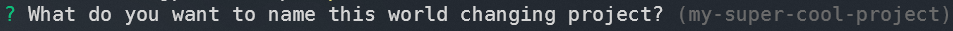

## Links:

- [NPM](https://www.npmjs.com/package/create-zp-cli)
- [GitHub](https://github.com/ZachCodedThat/create-zp-cli-public)

---

# Why?

It was a fun way to learn deeper concepts around [Node](https://nodejs.org/en/).

Currently this is just a barebones CLI that gives you the choice of 4 templates

## Eventually

I want to build this out to provide theme tooling choices like [Chakra-UI](https://chakra-ui.com/) and [Tailwind](https://tailwindcss.com/) but as of right now the templates come with barebones CSS styling.

---

## Built using

---

## Usage

Run `npx create-zp-cli` to start your good time.

**Note:** If no flags are passed you will be prompted for a template choice and whether you want to install the deeps within the project along with the name of your project.

Once completed let the magic happen and you are off to the races!

---

### Flags

`--yes , -y` Skips all prompts and passes default vlaues for all options, **defaults** to `false`

---

`--install , -i` Installs all chosen template dependencies, **defaults** to `false`

---

`[template]` Specifies what template you want to use. spelling matters capitalization does not **defaults** to `NextJS`

Template choices: **NextJS** || **NextJS-Typescript** || **React** || **React-Typescript**

---

## Dependencies

"[arg](https://www.npmjs.com/package/arg)": "^5.0.1", - Handles the initial flags that can be passed to the cli. _src/cli.js_

"[chalk](https://www.npmjs.com/package/chalk)": "^4.1.2", - Handles fancy command line styling. _src/main.js_

"[degit](https://www.npmjs.com/package/degit)": "^2.8.4", - Handles how to clone a clean repo from GH _src/main.js_

"[esm](https://www.npmjs.com/package/esm)": "^3.2.18", - Used to allow for “import” statements to be used in the node environment without having to worry about differing node versions _bin/create-zp-cli.js_

"[inquirer](https://www.npmjs.com/package/inquirer)": "^8.2.0", - Handles the questions asked for the options not provided to the cli via flags. _src/cli.js_

"[listr](https://www.npmjs.com/package/listr)": "^0.14.3", - Handles the tasks that need to be completed according to what options are passed in to the cli via flags and prompts _src.main.js_

## "[pkg-install](https://www.npmjs.com/package/pkg-install)": "^1.0.0" - Handles the installation of the dependencies in the new repo directory. _src/main.js_
