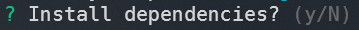

# Why?

It was a fun way to learn deeper concepts around [Node](https://nodejs.org/en/).

Currently this is just a barebones CLI that gives you the choice of 4 templates

## Eventually

I want to build this out to provide theme tool choices like [Chakra-UI](https://chakra-ui.com/) and [Tailwind](https://tailwindcss.com/) but as of right now the templates come with barebones CSS styling.

---

## Built using

---

## Usage

Run `npx create-zp-cli` to start your good time.

**Note:** If no flags are passed you will be prompted for a template choice and wether you want to install the deeps within the project along with the name of your project.

Once completed let the magic happen and you are off to the races!

---

### Flags

`--yes , -y` Skips all prompts and passes default vlaues for all options, **defaults** to `false`

---

`--install , -i` Installs all chosen template dependencies, **defaults** to `false`

---

`[template]` Specifies what template you want to use. spelling matters capitalization does not **defaults** to `NextJS`

Template choices: **NextJS** || **NextJS-Typescript** || **React** || **React-Typescript**

---

---
